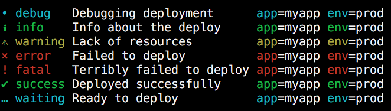
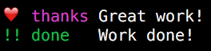

<div align="center">
  <a href="https://ttytoolkit.org" target="_blank"></a>
</div>

# TTY::Logger [][gitter]

[][gem]
[][gh_actions_ci]
[][appveyor]
[][codeclimate]
[][coverage]
[][inchpages]

[gitter]: https://gitter.im/piotrmurach/tty
[gem]: http://badge.fury.io/rb/tty-logger
[gh_actions_ci]: https://github.com/piotrmurach/tty-logger/actions?query=workflow%3ACI
[appveyor]: https://ci.appveyor.com/project/piotrmurach/tty-logger
[codeclimate]: https://codeclimate.com/github/piotrmurach/tty-logger
[coverage]: https://coveralls.io/github/piotrmurach/tty-logger
[inchpages]: http://inch-ci.org/github/piotrmurach/tty-logger

> A readable, structured and beautiful logging for the terminal

**TTY::Logger** provides independent logging component for [TTY toolkit](https://github.com/piotrmurach/tty).



## Features

* Intuitive console output for an increased readability
* Ability to stream data to any IO object
* Supports structured data logging
* Filters sensitive data
* Allows to define custom log types
* Formats and truncates messages to avoid clogging logging output
* Customizable styling of labels and symbols for console output
* Includes metadata information: time, location, scope
* Handles multiple logging outputs

## Installation

Add this line to your application's Gemfile:

```ruby
gem "tty-logger"
```

And then execute:

    $ bundle

Or install it yourself as:

    $ gem install tty-logger


## Contents

* [1. Usage](#1-usage)
* [2. Synopsis](#2-synopsis)
  * [2.1 Logging](#21-logging)
    * [2.1.1 Exceptions](#211-exceptions)
    * [2.1.2 Types](#212-types)
  * [2.2 Levels](#22-levels)
    * [2.2.1 Scoped Level](#22-scoped-level)
  * [2.3 Structured Data](#23-structured-data)
  * [2.4 Configuration](#24-configuration)
    * [2.4.1 Metadata](#241-metadata)
    * [2.4.2 Filters](#242-filters)
  * [2.5 Cloning](#25-cloning)
  * [2.6 Handlers](#26-handlers)
    * [2.6.1 Console Handler](#261-console-handler)
    * [2.6.2 Stream Handler](#262-stream-handler)
    * [2.6.3 Custom Handler](#263-custom-handler)
    * [2.6.4 Multiple Handlers](#264-multiple-handlers)
  * [2.7 Formatters](#27-formatters)
  * [2.8 Output streams](#28-output-streams)
* [3. Community Extensions](#3-community-extensions)
  * [3.1 Sentry Handler](#31-sentry-handler)

## 1. Usage

Create logger:

```ruby
logger = TTY::Logger.new
```

And log information using any of the logger [built-in types](#212-types):

```ruby
logger.info "Deployed successfully"
logger.info "Deployed", "successfully"
logger.info { "Dynamically generated info" }
```

Include structured data:

```ruby
logger.success "Deployed successfully", app: "myapp", env: "prod"
# =>
# ✔ success Deployed successfully     app=myapp env=prod
```

Add [metadata](#241-metadata) information:

```ruby
logger = TTY::Logger.new do |config|
  config.metadata = [:date, :time]
end
logger.info "Deployed successfully", app: "myapp", env: "prod"
# =>
# [2019-07-17] [23:21:55.287] › ℹ info    Info about the deploy     app=myapp env=prod
```

Or change structured data [formatting](#27-formatters) display to `JSON`:

```ruby
logger = TTY::Logger.new do |config|
  config.formatter = :json
end
logger.info "Deployed successfully"
# =>
# [2019-07-17] [23:21:55.287] › ℹ info    Info about the deploy     {"app":"myapp","env":"prod"}
```

## 2. Synopsis

## 2.1 Logging

There are many logger types to choose from:

* `debug` - logs message at `:debug` level
* `info` - logs message at `:info` level
* `success` - logs message at `:info` level
* `wait` - logs message at `:info` level
* `warn` - logs message at `:warn` level
* `error` - logs message at `:error` level
* `fatal` - logs message at `:fatal` level

To log a message, simply choose one of the above types and pass in the actual message. For example, to log successfully deployment at info level do:

```ruby
logger.success "Deployed successfully"
# =>
# ✔ success Deployed successfully
```

Or pass in multiple messages:

```ruby
logger.success "Deployed", "successfully"
# =>
# ✔ success Deployed successfully
```

You can delay message evaluation by passing it inside a block:

```ruby
logger.success { "Dynamically generated info" }
# =>
# ✔ success Dynamically generated info
```

Similar to regular logging, you cal split your message into chunks inside a block:

```ruby
logger.success { ["Dynamically", "generated", "info"] }
# =>
# ✔ success Dynamically generated info
```

The above comes handy when paired with [structured data](#23-structured-data).

#### 2.1.1 Exceptions

You can also report on exceptions.

For example, let's say you caught an exception about incorrect data format and use `fatal` level to log it:

```ruby
begin
  raise ArgumentError, "Wrong data"
rescue => ex
  logger.fatal("Error:", ex)
end
```

This will result in a message followed by a full backtrace:

```ruby
# =>
# ! fatal   Error: Wrong data
#    tty-logger/spec/unit/exception_spec.rb:12:in `block (2 levels) in <top (required)>'
#    rspec-core-3.8.2/lib/rspec/core/example.rb:257:in `instance_exec'
#    rspec-core-3.8.2/lib/rspec/core/example.rb:257:in `block in run'
```

#### 2.1.2 Types

You can define custom log types via the `types` configuration option:

For example, if you want to add `thanks` and `done` log types, you need to provide their names along with logging levels. You can further customise the `:console` output with your desired styling:

```ruby
logger = TTY::Logger.new do |config|
  config.types = {
    thanks: {level: :info},
    done: {level: :info}
  }
  config.handlers = [
    [:console, {
      styles: {
        thanks: {
          symbol: "❤️ ",
          label: "thanks",
          color: :magenta,
          levelpad: 0
        },
        done: {
          symbol: "!!",
          label: "done",
          color: :green,
          levelpad: 2
        }
      }
    }]
  ]
end
```

Once defined, you can call new log types:

```ruby
logger.thanks("Great work!")
logger.done("Work done!")
# =>
# ❤️  thanks Great work!
# !! done   Work done!
```



### 2.2 Levels

The supported levels, ordered by precedence, are:

* `:debug` - for debug-related messages
* `:info` - for information of any kind
* `:warn` - for warnings
* `:error` - for errors
* `:fatal` - for fatal conditions

So the order is: `:debug` < `:info` < `:warn` < `:error` < `:fatal`

For example, `:info` takes precedence over `:debug`. If your log level is set to `:info`, `:info`, `:warn`, `:error` and `:fatal` will be printed to the console. If your log level is set to `:warn`, only `:warn`, `:error` and `:fatal` will be printed.

You can set level using the `level` configuration option. The value can be a symbol, a string or level constant. For example, `:info`, `INFO` or `TTY::Logger::INFO_LEVEL` will qualify as valid level value.

```ruby
TTY::Logger.new do |config|
  config.level = :info # or "INFO" or TTY::Logger::INFO_LEVEL
end
```

Or you can specific level for each log events handler.

For example, to log messages above `:info` level to a stream and only `:error` level events to the console do:

```ruby
logger = TTY::Logger.new do |config|
  config.handlers = [
    [:console, level: :error],
    [:stream, level: :info]
  ]
end
```

You can also change the [output streams](#28-output-streams) for each handler.

#### 2.2.1 Scoped Level

You can temporarily change level, raise it or lower it by using the `log_at` call. By default messages are logged at `:info` level, but you can change this for the duration of a block:

```ruby
logger = TTY::Logger.new

logger.info("not logged")

logger.log_at :debug do
  logger.debug("logged")
end
# =>
# • debug   logged
```

Or elevate a level to an error with a constant `ERROR_LEVEL`:

```ruby
logger.log_at TTY::Logger::ERROR_LEVEL do
  logger.debug("not logged")
  logger.error("logged")
end
# =>
# ⨯ error   logged
```

### 2.3 Structured data

To add global data available for all logger calls:

```ruby
logger = TTY::Logger.new(fields: {app: "myapp", env: "prod"})

logger.info("Deploying...")
# =>
# ℹ info    Deploying...              app=myapp env=prod
```

To only add data for a single log event:

```ruby
logger = TTY::Logger.new
logger.wait "Ready to deploy", app: "myapp", env: "prod"
# =>
# … waiting Ready to deploy           app=myapp env=prod
```

You can delay data evaluation until it's evaluated by passing it inside a block:

```ruby
logger.wait { ["Ready to deploy", {app: "myapp", env: "prod"}] }
# =>
# … waiting Ready to deploy           app=myapp env=prod
```

### 2.4 Configuration

All the configuration options can be changed globally via `configure` or per logger instance.

* `:filters` - the storage of placeholders to filter sensitive data out from the logs. Defaults to `{}`.
* `:formatter` - the formatter used to display structured data. Defaults to `:text`. See [Formatters](#27-formatters) for more details.
* `:handlers` - the handlers used to log messages. Defaults to `[:console]`. See [Handlers](#26-handlers) for more details.
* `:level` - the logging level. Any message logged below this level will be simply ignored. Each handler may have it's own default level. Defaults to `:info`
* `:max_bytes` - the maximum message size to be logged in bytes. Defaults to `8192` bytes. The truncated message will have `...` at the end.
* `:max_depth` - the maximum depth for nested structured data. Defaults to `3`.
* `:metadata` - the meta info to display before the message, can be `:pid`, `:date`, `:time` or `:file`. Defaults to empty array `[]`, no metadata. Setting this to `:all` will print all the metadata.
* `:types` - the new custom log types. Defaults to `{}`.
* `:date_format` - uses `strftime` format to display dates. Defaults to `"%F"`.
* `:time_format` - uses `strftime` format to display times. Defaults to `"%T.%3N"`.

For example, to configure `:max_bytes`, `:level` and `:metadata` for all logger instances do:

```ruby
TTY::Logger.configure do |config|
  config.max_bytes = 2**10
  config.level = :error
  config.metadata = [:time, :date]
end
```

Or if you wish to setup configuration per logger instance use block:

```ruby
logger = TTY::Logger.new do |config|
  config.max_bytes = 2**20
  config.metadata = [:all]
end
```

You can also change the logger's configuration at runtime:

```ruby
logger.configure do |config|
  config.level = :debug
end
```

### 2.4.1 Metadata

The `:metdata` configuration option can include the following symbols:

* `:pid` - the log event process identifier
* `:date` - the log event date
* `:time` - the log event time
* `:file` - the file with a line number the log event is triggered from

### 2.4.2 Filters

You can filter sensitive data out of log output with `filters` configuration option. The `filters` can be further configured to remove info from log message with `message` or structured data with `data`. Both methods, as a value accept a list of sensitive items to search for.

If you want to filter sensitive information from log messages use `message`:

```ruby
logger = TTY::Logger.new(output: output) do |config|
  config.filters.message = %w[secret password]
end
```

Which by default will replace each matching string with `[FILTERED]` placeholder:

```ruby
logger.info("Super secret info with password")
# =>
# ℹ info    Super [FILTERED] info with [FILTERED]
```

You can also replace each data item with a custom placeholder. To do so use a `:mask` keyword with a replacement placeholder.

For example, to replace "secret" content with placeholder `"<SECRET>"` do:

```ruby
logger = TTY::Logger.new do |config|
  config.filters.message = %w[secret]
  config.filters.mask = "<SECRET>"
end
```

When logged, it will produce:

```ruby
logger.info("Super secret info")
# =>
# ℹ info    Super <SECRET> info
```

To filter out sensitive information out of structured data use `data` method. By default any value matching a parameter name will be filtered regardless of the level of nesting. If you wish to filter only a specific deeply nested key use a dot notation like `params.card.password` to only filter `{params: {card: {password: "Secret123"}}}`.

For example to filter out a `:password` from data do:

```ruby
logger = TTY::Logger.new do |config|
  config.filters.data = %i[password]
end
```

This will filter out any key matching password:

```ruby
logger.info("Secret info", password: "Secret123", email: "")
# =>
# ℹ info    Secret info     password="[FILTERED]" email="secret@example.com"
```

But also any nested data item:

```ruby
logger.info("Secret info", params: {password: "Secret123", email: ""})
# =>
# ℹ info    Secret info     params={password="[FILTERED]" email="secret@example.com"}
```

You're not limited to using only direct string comparison. You can also match based on regular expressions. For example, to match keys starting with `ba` we can add a following filter:

```ruby
logger = TTY::Logger.new do |config|
  config.filters.data = [/ba/]
end
```

Then appropriate values will be masked:

```ruby
logger.info("Filtering data", {"foo" => {"bar" => "val", "baz" => "val"}})
# =>
# ℹ info    Filtering data            foo={bar="[FILTERED]" baz="[FILTERED]"}
```

You can mix and match. To filter keys based on pattern inside a deeply nested hash use dot notation with regular expression. For example, to find keys for the `:foo` parent key that starts with `:b` character, we could do:

```ruby
logger = TTY::Logger.new do |config|
  config.filters.data = [/^foo\.b/]
end
```

Then only keys under the `:foo` key will be filtered:

```ruby
logger.info("Filtering data", {"foo" => {"bar" => "val"}, "baz" => {"bar" => val"}})
# =>
# ℹ info    Filtering data            foo={bar="[FILTERED]"} baz={bar=val}
```

### 2.5 Cloning

You can create a copy of a logger with the current configuration using the `copy` method.

For example, given the following logger with `:app` and `:env` data:

```ruby
logger = TTY::Logger.new(fields: {app: "parent", env: "prod"})
```

We can create a copy with a custom configuration that changes filtered message content and `:app` data:

```ruby
child_logger = logger.copy(app: "child") do |config|
  config.filters = ["logging"]
end
```

```ruby
logger.info("Parent logging")
child_logger.warn("Child logging")
# =>
# ℹ info    Parent logging            app=parent env=prod
# ⚠ warning Child [FILTERED]          app=child env=prod
```

### 2.6 Handlers

`TTY::Logger` supports many ways to handle log messages.

The available handlers by default are:

* `:console` - log messages to the console, enabled by default
* `:null` - discards any log messages
* `:stream` - log messages to an `IO` stream, a file, a socket or a console.

You can also implement your own [custom handler](#263-custom-handler).

The handlers can be configured via global or instance configuration with `handlers`. The handler can be a name or a class name:

```ruby
TTY::Logger.new do |config|
  config.handlers = [:console]
end
```

Or using class name:

```ruby
TTY::Logger.new do |config|
  config.handlers = [TTY::Logger::Handlers::Console]
end
```

Handlers can also be added/removed dynamically through `add_handler` or `remove_handler`.

```ruby
logger = TTY::Logger.new
logger.add_handler(:console)
logger.remove_handler(:console)
```

#### 2.6.1 Console Handler

The console handler prints log messages to the console. It supports the following options:

* `:styles` - a hash of styling options.
* `:formatter` - the formatter for log messages. Defaults to `:text`.
* `:output` - the device to log error messages to. Defaults to `$stderr`.
* `:message_format` - uses `sprintf` format to display messages. Defaults to `"%-25s"`.
* `:enable_color` - when `true` forces colored output, when `false` disables colored output.
                    Defaults to `nil` which performs automatic terminal color support detection.

The supported options in the `:styles` are:

* `:label` - the name for the log message.
* `:symbol` - the graphics to display before the log message label.
* `:color` - the color for the log message.
* `:levelpad` - the extra amount of padding used to display log label.

See the [TTY::Logger::Handlers::Console](https://github.com/piotrmurach/tty-logger/blob/master/lib/tty/logger/handlers/console.rb) for full list of styles.

Console handler has many default styles such as `success` and `error`:

```ruby
logger = TTY::Logger.new
logger.success("Default success")
logger.error("Default error")
# =>
# ✔ success Default success
# ⨯ error   Default error
```

You can change the default styling with a tuple of handler name and options hash.

In our example, we want to change the styling of `success` and `error`:

```ruby
new_styles = {
  styles: {
    success: {
      symbol: "+",
      label: "Ohh yes"
    },
    error: {
      symbol: "!",
      label: "Dooh",
      levelpad: 3 # the amount of extra padding to align level names in a column
    }
  }
}
```

And then use the `new_styles` when providing `handlers` configuration:

```ruby
styled_logger = TTY::Logger.new do |config|
  config.handlers = [[:console, new_styles]]
end

styled_logger.success("Custom success")
styled_logger.error("Custom error")
# =>
# + Ohh yes Custom success
# ! Dooh    Custom error
```

To increase message padding to a percentage of terminal width (depends on [tty-screen](https://github.com/piotrmurach/tty-screen/)):

```ruby
TTY::Logger.new do |config|
  padding = (TTY::Screen.columns * 0.4).to_i
  config.handlers = [[:console, { message_format: "%-#{padding}s" }]]
end
```

#### 2.6.2 Stream handler

To send log event data outside of console to another service or `IO` stream, you can use `:stream` handler.

```ruby
logger = TTY::Logger.new(output: output) do |config|
  config.handlers = [:stream]
  config.metadata = [:all]
end
```

By default, the output will be a plain text streamed to console. The text contains key and value pairs of all the metadata and the message of the log event.

```ruby
logger.info("Info about the deploy", app: "myapp", env: "prod")
# =>
# pid=18315 date="2019-07-21" time="15:42:12.463" path="examples/stream.rb:17:in`<main>`"
# level=info message="Info about the deploy" app=myapp env=prod
```

You can change stream formatter for ease of working with external services such as `Logstash`. For example, to use `:stream` handler with `:json` format do:

```ruby
logger = TTY::Logger.new(output: output) do |config|
  config.handlers = [[:stream, formatter: :json]]
  config.metadata = [:all]
end
```

This will output JSON formatted text streamed to console.

```ruby
logger.info("Info about the deploy", app: "myapp", env: "prod")
# =>
# {"pid":18513,"date":"2019-07-21","time":"15:54:09.924","path":"examples/stream.rb:17:in`<main>`",
# "level":"info","message":"Info about the deploy","app":"myapp","env":"prod"}
```

#### 2.6.3 Custom Handler

You can create your own log event handler if the default ones don't match your needs.

The design of your handler should include two calls:

* `initialize` - where all dependencies get injected
* `call` - where the log event is handled

We start with the implementation of the `initialize` method. This method by default is injected with `:config` key that includes all global configuration options. The `:output` key for displaying log message in the console and `:formatter`.

In our case we also add custom `:label`:

```ruby
class MyHandler
  def initialize(output: nil, config: nil, formatter: nil, label: nil)
    @label = label
    @output = output
  end
end
```

Next is the `call` method that accepts the log `event`.

The `event` has the following attributes:

* `message` - the array of message parts to be printed
* `fields` - the structured data supplied with the event
* `metadata` - the additional info about the event. See [metadata](#241-metadata) section for details.

We add implementation of `call`:

```ruby
class MyHandler
  def initialize(output: nil, config: nil, label: nil)
    @label = label
    @output = output
  end

  def call(event)
    @output.puts "(#{@label}) #{event.message.join}"
  end
end
```

Once you have your custom handler, you need to register it with the logger. You can do so using the `handlers` configuration option:

```ruby
logger = TTY::Logger.new do |config|
  config.handlers = [[MyHandler, label: "myhandler"]]
end
```

Or add your handler dynamically after logger initialization:

```ruby
logger = TTY::Logger.new
logger.add_handler [MyHandler, label: "myhandler"]
```

#### 2.6.4 Multiple Handlers

You can define as many handlers as you need. For example, you may log messages both to console and stream:

```ruby
logger = TTY::Logger.new do |config|
  config.handlers = [:console, :stream]
end
```

Each handler can have its own configuration. For example, you can register `:console` handler to log messages above error level and `:stream` that logs any message with info or higher level:

```ruby
logger = TTY::Logger.new do |config|
  config.handlers = [
    [:console, level: :error],
    [:stream, level: :info]
  ]
end
```

### 2.7 Formatters

The available formatters are:

* `:json`
* `:text`

You can configure format for all the handlers:

```ruby
TTY::Logger.new do |config|
  config.formatter = :json
end
```

Or specify a different formatter for each handler. For example, let's say you want to log to console twice, once with default formatter and once with `:json` formatter:

```ruby
TTY::Logger.new do |config|
  config.handlers = [:console, [:console, formatter: :json]]
end
```

### 2.8 Output Streams

By default all log events are output to `stderr`. You can change this using configuration `output` option. Any `IO`-like stream such as file, socket or console can be used. For example, to log all messages to a file do:

```ruby
logger = TTY::Logger.new do |config|
  config.output = File.open("errors.log", "a")
end
```

You can also specify multiple streams that all log messages will be sent to:

```ruby
logger = TTY::Logger.new do |config|
  config.output = [$stderr, File.open("errors.log", "a")]
end
```

Conversely, you can specify different output for each of the handlers used. For example, you can output all messages above info level to a file with a stream handler and only show error messages in the console with a nicely formatted output.

```ruby
logger = TTY::Logger.new do |config|
  config.handlers = [
    [:console, output: $stderr, level: :error],
    [:stream, output: File.open("errors.log", "a"), level: :info)]
  ]
end
```

## 3. Community Extensions

### 3.1 Sentry Handler

[tty-logger-raven](https://github.com/ianks/tty-logger-raven) provides an extension for Sentry.io.

## Development

After checking out the repo, run `bin/setup` to install dependencies. Then, run `rake spec` to run the tests. You can also run `bin/console` for an interactive prompt that will allow you to experiment.

To install this gem onto your local machine, run `bundle exec rake install`. To release a new version, update the version number in `version.rb`, and then run `bundle exec rake release`, which will create a git tag for the version, push git commits and tags, and push the `.gem` file to [rubygems.org](https://rubygems.org).

## Contributing

Bug reports and pull requests are welcome on GitHub at https://github.com/piotrmurach/tty-logger. This project is intended to be a safe, welcoming space for collaboration, and contributors are expected to adhere to the [code of conduct](https://github.com/piotrmurach/tty-logger/blob/master/CODE_OF_CONDUCT.md).

## License

The gem is available as open source under the terms of the [MIT License](https://opensource.org/licenses/MIT).

## Code of Conduct

Everyone interacting in the TTY::Logger project’s codebases, issue trackers, chat rooms and mailing lists is expected to follow the [code of conduct](https://github.com/piotrmurach/tty-logger/blob/master/CODE_OF_CONDUCT.md).

## Copyright

Copyright (c) 2019 Piotr Murach. See LICENSE for further details.
